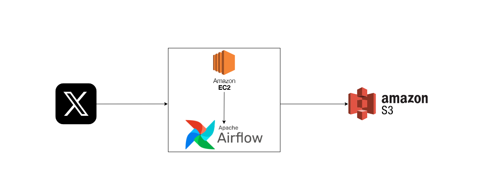
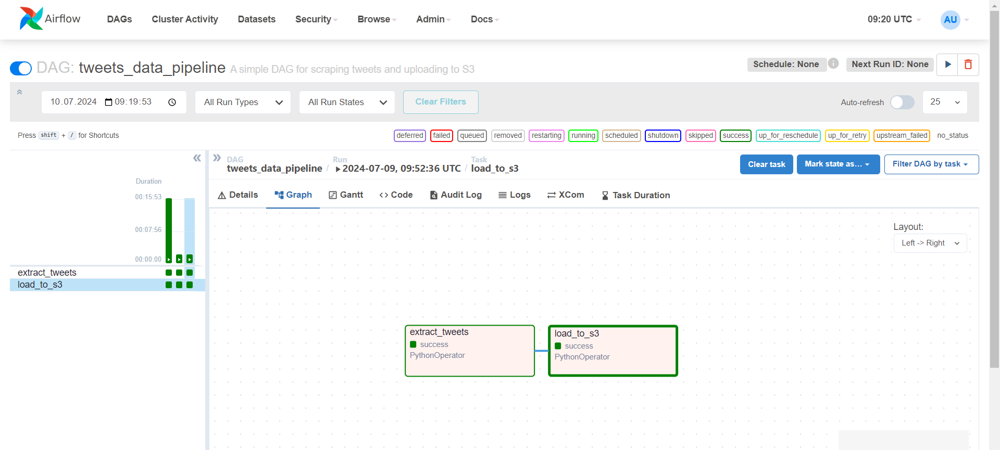
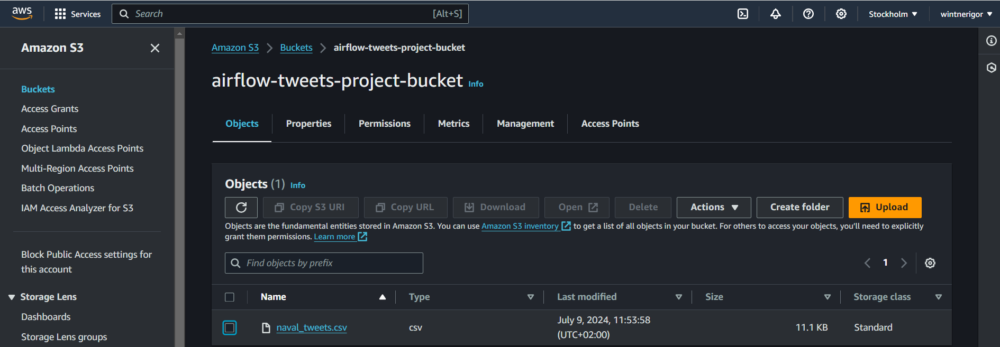

# Twitter (X) Data Pipeline with EC2, Airflow and S3

## Project Summary
This engineering project implements a comprehensive **ETL (Extract, Transform, Load)** data pipeline designed to manage Twitter (X) data (Tweets). It leverages **Amazon EC2** for deploying and running the pipeline, **Apache Airflow** for orchestrating the ETL workflow, **Selenium** for scraping tweets, **Pandas** for data transformation, and **boto3** for interacting with AWS services to upload the data. The pipeline automates the process of collecting tweets, transforming them to meet specific criteria, and storing the results in **Amazon S3**.

## Overview
**Pipeline Workflow:**

1. **Extract Tweets:** The Extract Tweets Task uses Selenium to scrape tweets from [Naval Ravikant](https://x.com/naval) Twitter (X) account. CSV file does not contain all the tweets; the selection is not chronological and contains tweets with a large number of likes (tweets that first appear to a user who is not logged into Twitter (X).
2. **Transform Data:** The Transform Data Task processes the collected tweets to remove irrelevant content and formats the data for clarity.
3. **Load Data:** The Load to S3 Task uploads the transformed tweet data to an Amazon S3 bucket for long-term storage and potential future analysis.

[View ETL Code](/twitter_etl/twitter_etl.py)

**Airflow DAG:** The overall workflow is managed by an Airflow DAG that orchestrates the entire process.

[View DAG Code](/twitter_dag/tweets_data_pipeline_dag.py)

## Architecture

*Architecture graph of the data pipeline*

**Key Components and Technologies:**

- **Twitter (X):** Source of the data (tweets).
- **Python**
    - **Selenium WebDriver:** Automates the extraction of tweets from a Twitter (X) account by simulating browser interactions.
    - **Pandas:** Performs data transformation and filtering to clean and prepare the tweet data for storage.
    - **boto3:** Manages the upload of the processed tweet data to an Amazon S3 bucket.

- **Apache Airflow:** Orchestrates the ETL workflow through Directed Acyclic Graphs (DAGs), managing task scheduling, execution, and dependencies.

- **Amazon Web Services (AWS)**
    - **Amazon EC2:** Provides the computational resources to deploy and run the ETL pipeline.
    - **Amazon S3:** Serves as the cloud storage solution for the transformed tweet data, ensuring reliable and scalable storage.
## DAG Overview

*Directed Acyclic Graph (DAG) visualized in Apache Airflow*

**The Directed Acyclic Graph (DAG)** visualized in **Apache Airflow** illustrates the end-to-end workflow for my **Twitter (X)** ETL pipeline. The DAG is composed of several tasks, each representing a step in the process to extract, transform, and load (ETL) tweet data from Naval Ravikant Twitter (X) account into an **Amazon S3** bucket.
## S3 Bucket containing CSV File with Tweets

*Screenshot displaying an Amazon S3 bucket where a CSV file named `naval_tweets.csv` is uploaded.* 
## Conclusion 
This project demonstrates the successful implementation of a relatively simple yet robust and automated ETL data pipeline using a combination of modern data engineering tools and AWS services. By leveraging Amazon EC2 for computational resources, Apache Airflow for workflow orchestration, Selenium for data extraction, Pandas for data transformation, and Amazon S3 for data storage, this pipeline efficiently manages the extraction, transformation, and loading of tweets from a specific Twitter (X) account. The code can be modified to adapt to other requirements, such as changing the Twitter (X) account or altering requests to extract different data. 

The complete codes for this data pipeline (links attached above) and the [output data](/data_output/naval_tweets.csv) are attached in the respective folders.

**Key Achievements:**

- Automated collection and processing of tweet data.
- Reliable and scalable data storage in Amazon S3.
- Clear separation of ETL tasks, ensuring modularity and maintainability.

**Future Enhancements:**

- Extend the pipeline to include sentiment analysis or other NLP techniques on the extracted tweets.
- Integrate with Amazon Redshift or another data warehouse for advanced analytics and reporting.
- Implement error handling and alerting mechanisms for improved reliability.
- Expand data sources to include multiple Twitter (X) accounts/more metadata of the tweets or other social media platforms.
